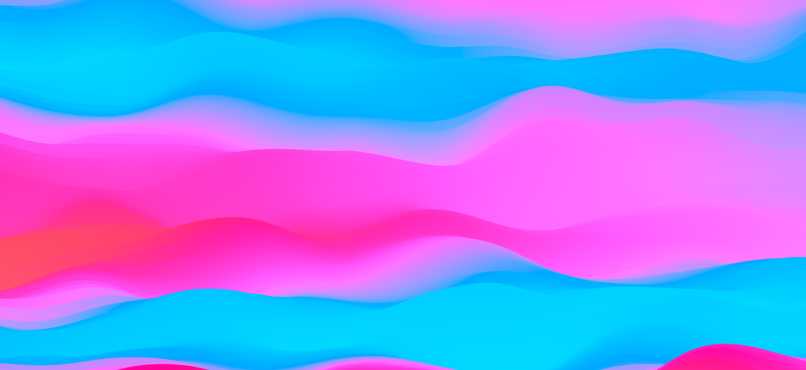

# 3D Mesh Gradient Experiments

[https://mesh-gradient.opl.io/](https://mesh-gradient.opl.io/)

An attempt to recreate the style of abstract imagery commonly used by tech companies as default device backgrounds, but inside of a WebGL shader!





# Development
Before you start, you should have [NodeJS](https://nodejs.org/en/) installed.
```
npm install
npm run dev
```

After running `dev`, open [localhost:5173](http://localhost:5173/). The page should automatically refresh when you make a change.

# Building & Deploying
```
npm run build
```
Outputs static files to `/dist/`.